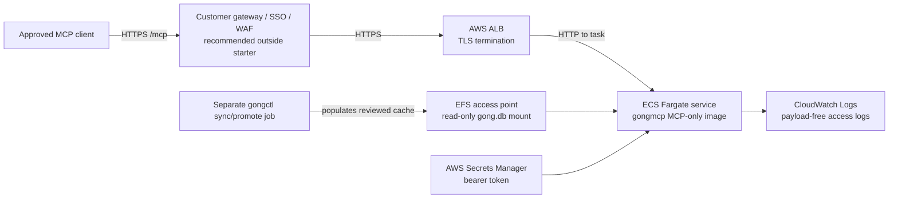
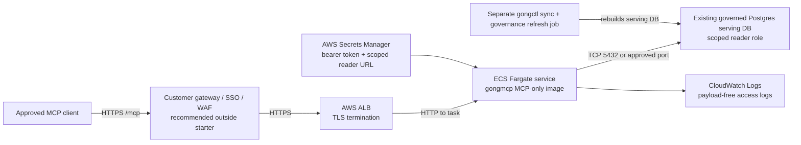
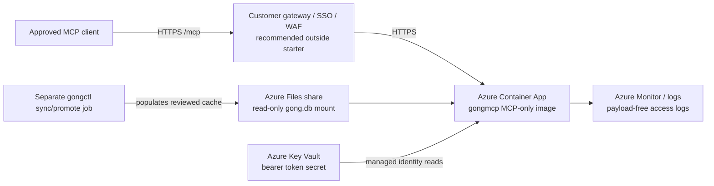
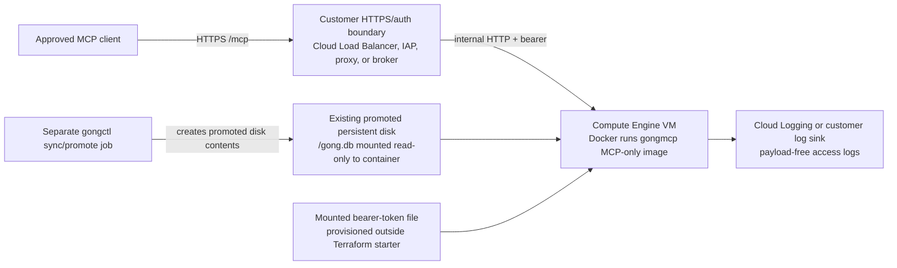

# Terraform Examples

These are non-production starter examples for customer-hosted `gongmcp` HTTP
pilots. The original cloud starters use the SQLite/file-mounted deployment
shape; `aws-ecs-postgres` shows the Postgres runtime shape against an existing
customer-managed serving database. They are lab-bridge snippets, not reusable
production modules or enterprise gateway reference architectures.
Copy the closest example into the customer's infrastructure repo, wire it to
existing networking, storage, DNS, TLS, secret management, logging,
identity-aware gateway/SSO, WAF or equivalent controls, rate limits, token
rotation, and change-control standards, then pin image digests before
promotion.

The examples assume:

- the writable `gongctl` sync job is handled separately
- the MCP runtime uses the MCP-only image
- for the SQLite starters, the SQLite cache is mounted read-only at
  `/data/gong.db`
- GCP VM deployments attach an existing promoted data disk that already contains
  `gong.db`; the starter does not create, sync, or promote that cache
- the Postgres starter deploys only `gongmcp` against an existing scoped reader
  URL; it does not create RDS, source/serving databases, roles, backups, PITR,
  or the writable `gongctl` sync/governance refresh jobs
- `gongmcp` receives no Gong API credentials
- HTTP mode uses bearer auth and an explicit tool allowlist
- public or cross-user access terminates TLS at customer-managed infrastructure

For end-user remote MCP, put these starters behind a customer-owned HTTPS and
OAuth/SSO boundary such as API Gateway, CloudFront plus WAF, ALB auth,
Cloudflare Access, or an equivalent broker. The static bearer token is the
internal hop from that boundary to `gongmcp`; it is not the end-user auth model.

## Examples

| Path | Shape | Use when |
| --- | --- | --- |
| `aws-ecs` | ECS Fargate service behind an HTTPS ALB with EFS-mounted SQLite cache | AWS customer wants container scheduling and managed TLS/load balancing for a file-backed MCP cache |
| `aws-ecs-postgres` | ECS Fargate service behind an HTTPS ALB with a Secrets Manager-mounted Postgres reader URL | AWS customer wants a repeatable MCP runtime against an existing governed Postgres serving DB |
| `azure-container-apps` | Azure Container App with Azure Files-mounted SQLite cache | Azure customer already uses Container Apps and Azure Files for a file-backed MCP cache |
| `gcp-compute-engine` | Compute Engine VM running the MCP-only container with a mounted SQLite disk | GCP customer wants the simplest POSIX filesystem path for SQLite |

## Postgres Deployments

`aws-ecs-postgres` configures the `gongmcp` Postgres runtime shape only.
Postgres MCP readers use `GONG_DATABASE_URL` or `DATABASE_URL`, omit the `--db`
flag and SQLite file mounts, and should run against a scoped reader user on a
redacted serving database when governance filtering is required.

The starter expects the customer platform team to provide the database
infrastructure and secret values. It does not create or manage:

- source or serving Postgres databases
- RDS, replicas, backups, PITR, KMS, or maintenance windows
- writer roles, scoped reader roles, or password rotation
- `gongctl` sync jobs or `governance refresh-serving-db`
- private governance YAML or blocklist contents

If the customer wants the simplest all-in-one VM path instead of Terraform,
start with [`deploy/single-vm-postgres`](../single-vm-postgres/README.md).
That Compose starter runs Postgres, operator job profiles, grant reconciliation,
and read-only `gongmcp` on one host while preserving the source/serving DB
split.

Use these docs for Postgres:

- [AWS ECS Postgres runtime starter](aws-ecs-postgres/README.md)
- [Single-VM Postgres starter](../single-vm-postgres/README.md)
- [Postgres client deployment runbook](../../docs/runbooks/postgres-client-deployment.md)
- [Docker Postgres shared deployment](../../docs/docker.md#postgres-shared-deployment)
- [Enterprise Postgres shared container deployment](../../docs/enterprise-deployment.md#2b-postgres-shared-container-deployment)

## Starter Diagrams

These diagrams show what each starter creates or expects. They intentionally
leave the customer-owned OAuth/SSO gateway, WAF policy, DNS, rate limits,
logging policy, and sync/promote job as integration points rather than claiming
to provide a production reference architecture.

### AWS ECS Starter



### AWS ECS Postgres Runtime Starter



### Azure Container Apps Starter



### GCP Compute Engine Starter



## Required Customer Decisions

Before applying any example, decide:

- who owns the writable sync job
- for SQLite starters, how the SQLite cache is refreshed and promoted to the
  read-only MCP runtime
- whether the SQLite MCP DB is a physically filtered governance copy; for
  Postgres, decide the source/serving database split and redaction flow from the
  Postgres runbook
- for Postgres, which customer-managed DB/secret/backup/rotation standards own
  the source DB, serving DB, writer URL, and scoped reader URL
- which tools are allowlisted
- which browser/client origins are allowed to call the MCP endpoint
- where the bearer token or OAuth broker secret lives
- which managed identity can read Key Vault secrets, for Azure Key
  Vault-backed token references
- how the populated `gong.db` cache is promoted to the read-only data volume,
  for VM or file-share based runtimes
- how secrets stay out of Terraform state, shell history, image layers, logs,
  and Git
- which HTTPS endpoint users paste into ChatGPT, Claude, or another remote MCP
  client
- where MCP access logs are stored and how raw payload logging is disabled
- for Postgres, which private network path allows the ECS task or container
  runtime to reach only the serving DB on the approved port
- whether a public/static-bearer lab bridge has been explicitly approved; the
  AWS starter requires `acknowledge_no_sso_gateway=true` before creating an
  externally reachable ALB without an in-module SSO gateway

## Per-Cloud Notes

AWS ECS:

- `service_egress_cidrs` defaults to `[]`. Keep internet egress closed, then
  add only the private CIDRs or VPC endpoint paths required for image pulls,
  CloudWatch Logs, Secrets Manager, and EFS in the customer's VPC design.
- If an implementation fails because a task cannot pull an image, read a
  secret, write logs, or mount EFS, fix the private endpoint/security-group
  route instead of reopening `0.0.0.0/0` by default.

AWS ECS Postgres:

- `database_url_secret_arn` must contain the scoped reader URL for the MCP
  serving database. Do not store a writer URL or source/raw database URL there.
- `ai_governance_config_secret_arn` is required when
  `postgres_redacted_serving_db=true`; `gongmcp` must load the same restricted
  account policy used to build the serving DB.
- Use `postgres_security_group_ids` or `postgres_egress_cidrs` to permit only
  the approved serving DB path. Keep broad service egress closed unless the
  customer explicitly approves private endpoint paths for image pulls, logs, or
  secret reads.
- Keep `enforce_tool_scoped_db_grants=true` and
  `postgres_redacted_serving_db=true` for governed client-facing deployments.

Azure Container Apps:

- Prefer `bearer_token_key_vault_secret_id` plus
  `user_assigned_identity_id`.
- Grant that identity Key Vault secret-read access before applying this
  starter, for example with the `Key Vault Secrets User` role on the vault or
  an equivalent customer-approved access policy.
- Use the raw `bearer_token` variable only for lab tests where Terraform state
  is protected and the customer accepts state-managed secret material.

GCP Compute Engine:

- `gong_data_disk_self_link` must point at an existing promoted disk that
  already contains `/gong.db`.
- The startup service refuses to start if the bearer-token file or
  `/mnt/disks/gong-data/gong.db` is missing.
- Put Cloud Load Balancing, Cloud Armor, IAP, a reverse proxy, or the
  customer's chosen HTTPS/auth gateway in front of the VM before user testing.

## Validation

Run formatting before use:

```bash
terraform fmt -recursive deploy/terraform
```

Then run provider-specific validation in the copied infrastructure repo after
backend, provider, networking, and storage variables are filled in.
