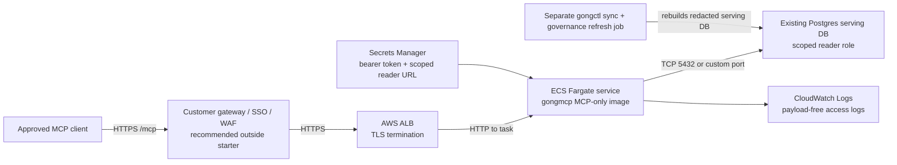

# AWS ECS Postgres Runtime Starter

This is a non-production Terraform starter for running `gongmcp` on ECS
Fargate against an existing customer-managed Postgres serving database.

It intentionally does not create RDS, source databases, serving databases,
roles, backups, PITR, or the writable `gongctl` sync job. Customer platform and
DBA owners should provision those pieces using their normal standards, then
provide this starter with:

- a scoped read-only Postgres URL stored in AWS Secrets Manager
- an internal MCP bearer token stored in AWS Secrets Manager
- the AI governance YAML stored in AWS Secrets Manager when redacted serving DB
  mode is enabled
- approved private network egress from the ECS task to the serving DB
- the selected MCP preset, usually `business-workbench`

Use the full Postgres deployment runbook before using this starter:

- [Postgres client deployment runbook](../../../docs/runbooks/postgres-client-deployment.md)

## Shape



## Required Inputs

The database URL secret must contain a reader URL for the MCP serving database,
not a writer URL and not the source/raw database URL. Store the URL as the
secret string value, or pass a Secrets Manager `valueFrom` ARN that selects the
JSON key containing the URL; do not put the URL directly in Terraform variables.

When `postgres_redacted_serving_db=true`, `ai_governance_config_secret_arn`
must contain the YAML policy content used to build the serving DB. The task
uses a short-lived sidecar to write that secret into an in-task file, then
starts `gongmcp` with `GONGMCP_AI_GOVERNANCE_CONFIG` pointing at the file. This
is required because `gongmcp` gates account-name probes with the same
restricted-name policy even when rows have already been physically removed from
the serving DB.

The `name` input is constrained to 21 characters so the derived ALB and target
group names stay within AWS limits.

For governed client-facing Postgres deployments, leave these defaults enabled:

```hcl
tool_preset                    = "business-workbench"
enforce_tool_scoped_db_grants  = true
postgres_redacted_serving_db   = true
```

Only set `postgres_redacted_serving_db=false` for an explicitly approved
non-redacted operator environment.

## Example Variables

```hcl
aws_region = "us-east-1"
name       = "gongctl-client-a"

vpc_id             = "vpc-..."
alb_subnet_ids     = ["subnet-...", "subnet-..."]
service_subnet_ids = ["subnet-...", "subnet-..."]

allowed_ingress_cidrs = ["10.0.0.0/8"]
alb_egress_cidrs      = ["10.0.0.0/8"]

acm_certificate_arn     = "arn:aws:acm:..."
bearer_token_secret_arn = "arn:aws:secretsmanager:..."
database_url_secret_arn = "arn:aws:secretsmanager:..."
ai_governance_config_secret_arn = "arn:aws:secretsmanager:..."

allowed_origins = "https://chatgpt.com,https://claude.ai"
tool_preset     = "business-workbench"

postgres_security_group_ids = ["sg-existing-postgres"]
```

If your organization uses CIDR egress instead of security-group egress, set
`postgres_egress_cidrs` instead.

## Preflight

Before applying:

1. Create or identify the source and serving Postgres databases.
2. Run `gongctl governance refresh-serving-db` to build the serving DB.
3. Create the scoped reader role and apply grants with
   `gongctl mcp postgres-reader-apply`.
4. Store only the scoped reader URL in `database_url_secret_arn`.
5. Store the matching private AI governance YAML in
   `ai_governance_config_secret_arn`.
6. Confirm the selected preset with `gongmcp --list-tool-presets`.
7. Confirm the ECS task egress path can reach the serving DB.

Do not put Gong API credentials, writer database URLs, governance YAML, raw
transcripts, or blocklist values in Terraform variables or state.
