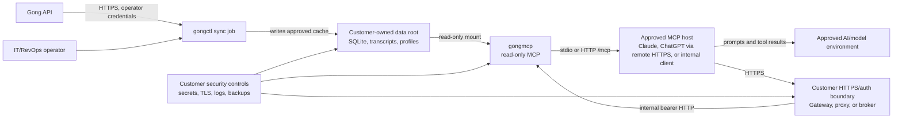

# Customer-Hosted Package

## Purpose

This is the customer-facing package map for enterprise review. The primary
document is the [Data Boundary Statement](data-boundary-statement.md); the rest
of the package supports deployment, security review, support, and operations.

## Package Contents

| Need | Included artifact |
| --- | --- |
| Developer/agent source map | [Developer orientation](developer-orientation.md) |
| Docker image or source-deployable package | [Docker deployment](docker.md), [Release versioning](release.md), `Dockerfile`, `.github/workflows/publish-images.yml` |
| Terraform examples | Non-production starters in [`deploy/terraform`](../deploy/terraform/README.md) |
| Environment-variable config | [Configuration surfaces](configuration-surfaces.md), `.env.example`, [Docker deployment](docker.md) |
| Read-only mode by default | [Security model](security-model.md), [Enterprise deployment](enterprise-deployment.md) |
| Tool preset/allowlist | [MCP data exposure](mcp-data-exposure.md), [Enterprise deployment](enterprise-deployment.md) |
| OAuth/SSO broker requirements | [Remote MCP auth and connector setup](remote-mcp-auth.md) |
| ChatGPT connector setup guide | [Remote MCP auth and connector setup](remote-mcp-auth.md#chatgpt-connector-setup) |
| Implementation worksheet | [Customer implementation checklist](implementation-checklist.md) |
| Data-flow diagram | This document |
| Deployment diagrams | [Enterprise deployment](enterprise-deployment.md#supported-deployment-modes), [`deploy/terraform`](../deploy/terraform/README.md#starter-diagrams) |
| Threat model | [Security model](security-model.md) |
| Audit-log schema | [Support](support.md#audit-log-schema-expectations) |
| No-sensitive-telemetry statement | [Data Boundary Statement](data-boundary-statement.md#no-sensitive-telemetry-statement) |
| Support-access policy | [Support](support.md) |
| Upgrade and rollback instructions | [Release versioning](release.md), [Enterprise deployment](enterprise-deployment.md#backup-retention-and-decommissioning) |
| Smoke-test scripts | `scripts/docker-smoke.sh`, `scripts/smoke-http-mcp.sh`, [Docker deployment](docker.md), [Customer implementation checklist](implementation-checklist.md#smoke-tests) |
| Example security questionnaire answers | [Security questionnaire](security-questionnaire.md) |
| Postgres shared-deployment pilot packet | [Postgres client pilot release packet](postgres-client-pilot-release-packet.md) |
| Postgres operator onboarding checklist | [Postgres client onboarding checklist](postgres-client-onboarding-checklist.md) |
| Postgres manual-test checklist | [Postgres client manual-test checklist](postgres-client-manual-test-checklist.md) |
| Postgres deployment runbook | [Postgres client deployment runbook](runbooks/postgres-client-deployment.md) |

## Data-Flow Diagram

## Default Deployment Boundary

Default enterprise posture:

- customer hosts the runtime, storage, logs, and secrets
- `gongctl` handles writable sync and Gong credentials
- `gongmcp` handles read-only MCP over an existing cache
- business users do not receive Gong credentials
- remote HTTPS/OAuth is customer-managed in front of `gongmcp`
- support starts with sanitized diagnostic bundles, not raw logs or payloads

## Quick Customer Sequence

1. Review the Data Boundary Statement.
2. For shared/containerized deployments, use the Postgres two-database path in
   the [Postgres deployment runbook](runbooks/postgres-client-deployment.md):
   a writable source DB for sync plus a governed/redacted serving DB for MCP.
3. Pin the image or commit. If this branch is used before a tagged release,
   record it as customer-ready pilot code, not a versioned GA tag.
4. Create a protected customer data root and secret-manager entries outside the
   source checkout. Gong credentials belong only to the operator sync job.
5. Sync the approved date window, build the read model, and import only a
   reviewed customer profile that passes
   `gongctl profile validate --ga-readiness`.
6. Refresh the redacted serving DB from the source DB and retain a
   source-vs-serving redaction audit artifact. Store only non-secret evidence
   paths and counts in acceptance artifacts.
7. Start `gongmcp` against the scoped Postgres reader with the
   `business-workbench` preset. New business users should see six public MCP
   tools; analyst operations remain routed behind the facade.
8. Expose HTTPS `/mcp` through the customer gateway/OAuth broker, or connect a
   local approved MCP host.
9. Run `scripts/postgres-ga-acceptance-smoke.sh` with `READER_DB_URL` and
   `REDACTION_AUDIT_JSON` or compact `REDACTION_AUDIT_*` fields. Save the JSON
   report and Markdown summary.
10. Connect the first business user only after `fail` checks are clear and any
    `degraded` checks have an owner, caveat, and remediation path.

Current customer-ready boundary: the package is suitable for controlled
customer-hosted usage when the profile gate, redacted serving refresh, scoped
reader grants, and GA acceptance smoke are all run and recorded. It is not a
self-serve tagged GA release until release notes, image digests, and the final
version tag are cut.

## Audience Start Points

| Audience | Start here | Do not own |
| --- | --- | --- |
| IT/security installer | [Customer implementation checklist](implementation-checklist.md), [Docker deployment](docker.md), [Remote MCP auth](remote-mcp-auth.md) | Gong business-profile decisions |
| Sync operator | [Quickstart](quickstart.md), [Operator sync runbook](runbooks/operator-sync.md) | end-user OAuth or model workspace policy |
| RevOps/admin | [Business profiles](profiles.md), [Customer implementation checklist](implementation-checklist.md#revops-profile-signoff) | container secrets or TLS |
| Business user | [Business user guide](business-user-guide.md), [Customer implementation checklist](implementation-checklist.md#business-user-first-10-minutes) | `gongctl`, credentials, profile import, raw data |
| Security reviewer | [Data Boundary Statement](data-boundary-statement.md), [Security model](security-model.md), [Support](support.md) | day-to-day prompt writing |

## What Is Intentionally Out Of Scope

This repo does not provide:

- vendor-hosted SaaS control plane
- multi-tenant user management
- native OAuth 2.1 in `gongmcp`
- browser transcript review app
- centralized vendor telemetry
- standing vendor support access

Those can be layered around the package by the customer or implemented as a
future application layer, but they should not be implied by the current
customer-hosted package.
