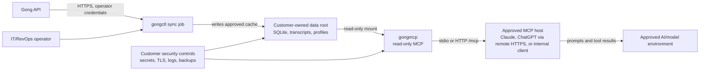

# Customer-Hosted Package

## Purpose

This is the customer-facing package map for enterprise review. The primary
document is the [Data Boundary Statement](data-boundary-statement.md); the rest
of the package supports deployment, security review, support, and operations.

## Package Contents

| Need | Included artifact |
| --- | --- |
| Docker image or source-deployable package | [Docker deployment](docker.md), [Release versioning](release.md), `Dockerfile`, `.github/workflows/publish-images.yml` |
| Terraform examples | [`deploy/terraform`](../deploy/terraform/README.md) |
| Environment-variable config | [Configuration surfaces](configuration-surfaces.md), `.env.example`, [Docker deployment](docker.md) |
| Read-only mode by default | [Security model](security-model.md), [Enterprise deployment](enterprise-deployment.md) |
| Tool allowlist | [MCP data exposure](mcp-data-exposure.md), [Enterprise deployment](enterprise-deployment.md) |
| OAuth/SSO setup guide | [Remote MCP auth and connector setup](remote-mcp-auth.md) |
| ChatGPT connector setup guide | [Remote MCP auth and connector setup](remote-mcp-auth.md#chatgpt-connector-setup) |
| Data-flow diagram | This document |
| Threat model | [Security model](security-model.md) |
| Audit-log schema | [Support](support.md#audit-log-schema-expectations) |
| No-sensitive-telemetry statement | [Data Boundary Statement](data-boundary-statement.md#no-sensitive-telemetry-statement) |
| Support-access policy | [Support](support.md) |
| Upgrade and rollback instructions | [Release versioning](release.md), [Enterprise deployment](enterprise-deployment.md#backup-retention-and-decommissioning) |
| Smoke-test script | `scripts/docker-smoke.sh`, [Docker deployment](docker.md) |
| Example security questionnaire answers | [Security questionnaire](security-questionnaire.md) |

## Data-Flow Diagram

## Default Deployment Boundary

Default enterprise posture:

- customer hosts the runtime, storage, logs, and secrets
- `gongctl` handles writable sync and Gong credentials
- `gongmcp` handles read-only MCP over an existing cache
- business users do not receive Gong credentials
- remote HTTPS/OAuth is customer-managed in front of `gongmcp`
- support starts with sanitized diagnostic bundles, not raw logs or payloads

## Quick Customer Sequence

1. Review the Data Boundary Statement.
2. Decide local stdio, private HTTP bearer pilot, or remote HTTPS/OAuth.
3. Create a protected customer data root outside the source checkout.
4. Configure Gong credentials for the operator sync job only.
5. Run a bounded sync and validate readiness.
6. Optional: export a physically filtered MCP database for AI-governed use.
7. Start `gongmcp` with a read-only cache mount and approved tool allowlist.
8. Connect Claude Desktop locally, or expose HTTPS `/mcp` through the customer
   OAuth broker for ChatGPT/remote clients.
9. Run `get_sync_status` and one bounded search smoke.
10. Generate a sanitized support bundle if deployment evidence is needed.

## What Is Intentionally Out Of Scope

This repo does not provide:

- vendor-hosted SaaS control plane
- multi-tenant user management
- native OAuth 2.1 in `gongmcp`
- browser transcript review app
- centralized vendor telemetry
- standing vendor support access

Those can be layered around the package by the customer or implemented as a
future application layer, but they should not be implied by the current
customer-hosted package.
