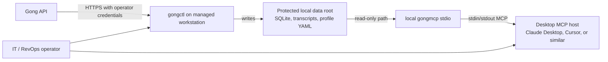
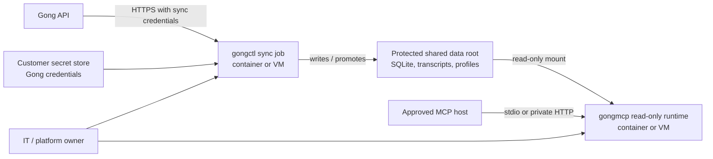
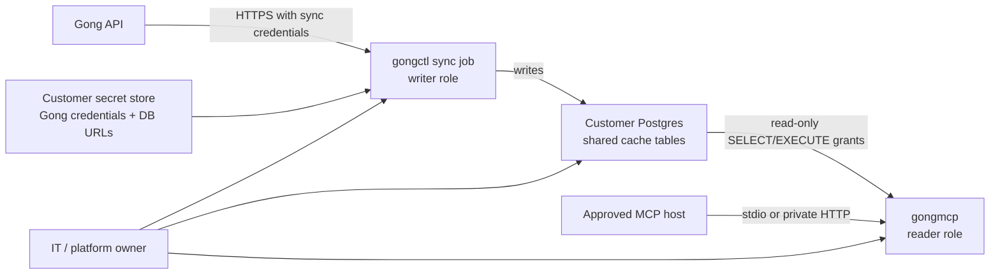
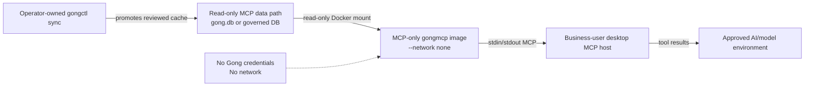
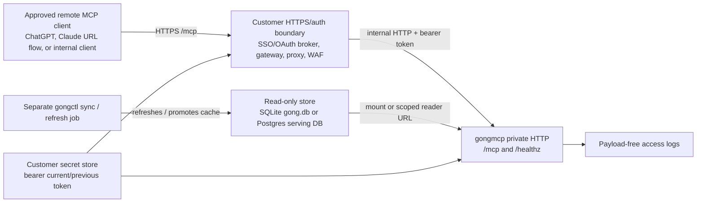

# Enterprise Deployment

## Purpose

This document defines the current enterprise pilot deployment shape for
`gongctl`. The core boundary is unchanged:

- `gongctl` is the writable operator tool that authenticates to Gong and
  refreshes local cache state.
- `gongmcp` is a read-only MCP server over the configured cache store. SQLite
  has the broadest local coverage; Postgres supports the explicitly listed
  shared-deployment slices, including reviewed `analyst` sessions.
  Postgres `all-readonly` parity remains a follow-up. It supports local stdio
  and a minimal HTTP `/mcp`
  private-pilot mode.
- Business users should consume only the approved MCP tool set through host or
  wrapper policy. They do not run live syncs, handle Gong credentials, or write
  to SQLite.

This is a pilot-candidate operating model, not a hosted service design.
Customer identity, raw transcripts, secrets, and tenant-specific filesystem
details should stay outside shared docs and outside the source repo.
For controlled multi-container Postgres sharing, pair this document with the
[Postgres client pilot release packet](postgres-client-pilot-release-packet.md).

Security-review readers should also use
[Data Boundary Statement](data-boundary-statement.md) for the customer-hosted
data boundary and [Support](support.md) for sanitized diagnostic-bundle and
support-access policy. The complete customer-hosted review packet is indexed in
[Customer-hosted package](customer-hosted-package.md). Remote HTTPS/OAuth and
ChatGPT connector setup are covered in
[Remote MCP auth and connector setup](remote-mcp-auth.md).

Current limitations still matter for deployment approval: `gongmcp` can narrow
its tool surface with an allowlist and can require bearer tokens for HTTP mode,
and `gongctl` now has a restricted company mode for high-risk CLI commands, but
neither control replaces operator ownership of storage, host policy, and
process access.

## Roles And Ownership

### IT / RevOps operator

- owns Gong credentials and sync scope
- runs or schedules `gongctl` refresh jobs
- controls SQLite, transcript, and profile storage
- validates cache freshness before exposing MCP to business users
- manages backup, retention, and decommissioning

### Business user

- uses an approved MCP host connected to `gongmcp`
- reads aggregate or bounded cached data only
- does not receive Gong credentials
- does not run writable CLI sync or profile-import commands

### Platform / security owner

- approves host, filesystem, backup, and monitoring controls
- approves the MCP tool set exposed to business users and configures the
  `gongmcp` allowlist for that deployment
- owns incident escalation and credential rotation policy

## Supported Deployment Modes

Use these diagrams as deployment-shape references. They show ownership and data
movement, not complete cloud networking or production identity design.

### 1. Admin workstation pilot

Use when one operator runs syncs on a managed workstation and optionally exposes
local MCP to a small reviewed pilot.



- `gongctl` runs with network access and operator-managed credentials.
- SQLite, transcript files, and profile YAML stay on protected local storage
  outside the repo.
- `gongmcp` reads the same cache through a read-only path.
- Best for initial validation, limited concurrency, and short pilot windows.

### 2. Company-managed container or VM

Use when the company wants a repeatable managed runtime without changing the
product boundary.



- Run `gongctl` in Docker or on a managed host for writable sync jobs.
- Mount a protected external data directory for the SQLite cache, transcript
  output, profiles, and backups.
- Keep Gong credentials in approved secret storage, not in the image.
- Run `gongmcp` as a separate read-only process or container against the same
  mounted cache.

### 2b. Postgres shared container deployment

Use when the sync/runtime containers cannot share a protected filesystem.



- SQLite remains supported for local/single-host installs.
- Postgres is the shared deployment path for separate sync and MCP containers.
- `gongctl` uses a writer database URL through `GONG_DATABASE_URL` or
  `DATABASE_URL`.
- `gongmcp` uses a read-only database URL and must not receive Gong
  credentials.
- The compatibility `gongmcp_reader` role is still supported as a service
  secret. For business-user deployments that need a narrower SQL credential,
  provision a function-scoped reader role and set
  `GONGMCP_ENFORCE_TOOL_SCOPED_DB_GRANTS=1`; `gongmcp` will reject missing
  selected-surface function grants and reject extra `gongmcp_*` function grants
  outside the selected preset or allowlist. The `business-pilot` preset also
  has a first reviewed table/column grant boundary; other presets still need
  per-surface maps or governed views/RLS before broad customer role automation.
  Generate the reviewed business-pilot grant block with the canonical operator
  command `gongctl mcp postgres-reader-sql --preset business-pilot --role ROLE
  --database DB`. To operationalize that reviewed block, create the LOGIN role
  and password through the customer secret manager, then run `gongctl mcp
  postgres-reader-apply --preset business-pilot --role ROLE --database DB
  --dry-run` for review and `--apply` with a writable `GONG_DATABASE_URL` /
  `DATABASE_URL` to reconcile grants for the existing role. `gongmcp
  --print-postgres-reader-grants --tool-preset business-pilot
  --postgres-reader-role ROLE --postgres-database DB` is a compatibility path
  for MCP-only images. Treat the scoped URL as a `gongmcp` service credential,
  not an analyst SQL login. The scoped
  active-profile and profile-cache helpers redact source metadata and call
  IDs/titles, and the direct profile-cache helper is capped at 1,000 rows per direct helper call, but selected
  functions still expose minimized operational metadata, timings, counts, and
  tenant terminology.
  This first scoped business-pilot role is profile-backed; explicit
  `lifecycle_source=builtin` still requires the broader compatibility reader
  until a sanitized builtin SQL surface exists.
- For approved Postgres `analyst` and `analyst-expansion` sessions, run
  `gongmcp` with the scoped analyst reader and
  `GONGMCP_ENFORCE_TOOL_SCOPED_DB_GRANTS=1`. That mode applies MCP-layer
  small-cell suppression to business-analysis dimension summaries: buckets
  below 3 calls are omitted and the response includes
  `small_cell_suppression_applied` / `small_cell_suppression_min_3` metadata.
  This is a conservative pilot guard, not a substitute for database-enforced
  RLS, materialized governed snapshots, or customer-specific privacy review.
- Operators can check or repair Postgres builtin fact readiness with
  `gongctl sync read-model` and `gongctl sync read-model --rebuild` using a
  writable database URL. MCP remains read-only and will not rebuild stale facts.
- Operators should verify Postgres backups by restoring into an isolated
  database, rebuilding readiness with the writable role, and running a
  read-only MCP smoke against the restored database. The repo provides a
  synthetic version of that drill through `scripts/postgres-backup-restore-smoke.sh`.
- The Postgres slice supports the explicit `business-pilot` preset through MCP
  (`get_sync_status`, `summarize_call_facts`,
  `summarize_calls_by_lifecycle`, and `rank_transcript_backlog`) plus narrow
  operator smoke/search allowlists for `search_calls`, `get_call`, and
  `search_transcript_segments`. `analyst-core` is the reviewed Postgres
  starter analyst surface for core call/profile/lifecycle/CRM-context
  inventory queries, cached CRM schema/settings inventory, scorecard inventory,
  and aggregate scorecard activity. `analyst-business-core` adds bounded
  transcript-evidence and business-analysis workflows. Directed CRM
  `list_unmapped_crm_fields`, `search_crm_field_values`,
  `analyze_late_stage_crm_signals`, `opportunities_missing_transcripts`, and
  `opportunity_call_summary`, plus aggregate CRM field-population diagnostics
  through `crm_field_population_matrix`, reviewed Opportunity lifecycle CRM
  field comparison through `compare_lifecycle_crm_fields`, admin
  transcript-backfill call references through `missing_transcripts`, and
  CRM-constrained transcript snippets
  through `search_transcripts_by_crm_context`, are available through explicit
  allowlists. The `compare_lifecycle_crm_fields`, `missing_transcripts`, and
  `search_transcripts_by_crm_context` Postgres slices require a tagged
  `v0.4.0` or later release for customer deployment. The reviewed
  Postgres `analyst` preset combines the supported analyst tools for approved
  analyst sessions; `all-readonly` parity remains a follow-up tracked in the
  [Postgres parity matrix](postgres-parity.md).
- AI governance filtered DB export is the SQLite file-copy path. For raw/source
  Postgres, prepare governance policy state for the narrowed
  `governance-search` MCP slice with
  `gongctl governance audit --apply-postgres-policy`. For client-facing
  Postgres, use `gongctl governance refresh-serving-db` to rebuild a physically
  redacted MCP serving database and connect `gongmcp` only to that database
  with a scoped reader role. Source-DB RLS remains a follow-up.
- For AWS customers that want Terraform for the read-only MCP runtime, use the
  starter in `deploy/terraform/aws-ecs-postgres` after the source DB, serving
  DB, scoped reader role, grant reconciliation, and governance refresh flow are
  already owned by the customer platform/DBA process.

### 3. MCP-only consumer host

Use when business-user access must be separated from the writable sync runtime.



- Build and publish the Docker `mcp` target, not the default full CLI image.
- Stdio `gongmcp` runs with `--network none` when containerized.
- Mount the SQLite cache read-only.
- Do not provide Gong credentials to the MCP process.
- Refresh happens upstream through operator-owned `gongctl` jobs only.

### 4. Private HTTP MCP pilot

Use when a company wants approved users or MCP hosts to connect to one
customer-managed endpoint instead of launching a local subprocess/container on
each workstation.



- For SQLite, run
  `gongmcp --http ADDR --auth-mode bearer --tool-preset business-pilot --db PATH`
  or use a reviewed custom `--tool-allowlist`.
- For Postgres, omit `--db`, set `GONG_DATABASE_URL` or `DATABASE_URL` to a
  scoped reader URL, and use an approved Postgres preset such as
  `business-workbench` with scoped grant enforcement where applicable.
- Expose `/mcp` to approved clients through TLS termination at a trusted
  company proxy/gateway or equivalent private-network boundary. Use `/healthz`
  for infrastructure health checks; do not use MCP JSON-RPC as the health
  probe.
- Set `--allowed-origins` or `GONGMCP_ALLOWED_ORIGINS` for every non-local HTTP
  deployment so browser-capable MCP clients cannot bypass the proxy boundary
  through DNS rebinding.
- Keep `gongctl` sync jobs separate from this read-only process.
- Store bearer tokens outside Git, SQLite, images, docs, and shared logs.
- Treat `--auth-mode none --dev-allow-no-auth-localhost` as local developer
  scaffolding only. Non-local unauthenticated HTTP is not supported.

The initial HTTP mode is intentionally small: POST JSON-RPC requests to `/mcp`;
GET streaming/SSE, user management, OIDC, tenant routing, and hosted transcript
review are not implemented here. Non-local HTTP binds require
`--allow-open-network` so operators make that deployment decision deliberately.
Every HTTP mode requires an explicit tool preset or allowlist, including loopback binds
behind a proxy/gateway.

## Storage Classes And Protection

Treat these artifacts as customer data:

- SQLite cache files
- transcript output directories
- tenant profile YAML files

Required controls:

- store them outside the source checkout
- limit access to named operators and approved service accounts
- use host or volume encryption where company policy requires it
- keep backups and restore copies in the same protected data class
- keep logs and review artifacts metadata-only; do not copy transcript text,
  secrets, raw payloads, or tenant-specific IDs into shared docs

Storage-specific guidance:

- SQLite contains cached call, user, transcript, CRM, settings, and sync state
  data, so it should be treated like a protected local database, not a scratch
  file.
- Transcript output contains raw normalized transcript JSON and should be kept
  at least as restricted as the SQLite cache.
- Profile YAML can encode tenant CRM object names, field names, lifecycle
  mappings, tracker names, or scorecard references and should be protected even
  when it does not contain transcript text.

## Network And Credential Boundary

`gongctl` and `gongmcp` have different trust assumptions:

- `gongctl` needs network access to Gong and valid credentials for `auth check`
  and `sync ...` commands.
- `gongmcp` reads the configured cache store only and should not receive Gong
  credentials. For Postgres deployments, give it a read-only database URL.
- For containerized stdio MCP, prefer `docker run --network none` with a
  read-only data mount.
- For HTTP MCP, require bearer auth, an explicit tool preset or allowlist, and TLS
  termination at a trusted proxy/gateway for shared access.
- For customer-specific AI-use restrictions, mount a private AI governance
  config, run `gongctl governance audit`, and start `gongmcp` with
  `--ai-governance-config` or `GONGMCP_AI_GOVERNANCE_CONFIG`. For raw/source
  Postgres, run `gongctl governance audit --apply-postgres-policy` with the
  writable URL before starting the read-only MCP container. For client-facing
  Postgres, refresh the redacted serving DB with
  `gongctl governance refresh-serving-db` and point `gongmcp` at the serving DB
  reader URL. Restart is mandatory after raw SQLite/Postgres cache/config/policy
  changes because `gongmcp` fingerprints governance state and fails closed if it
  changes while running; a same-URL serving DB refresh does not require restart.
- For shared environments, separate the writable sync runtime from the
  business-user MCP runtime even if both read the same protected data root.

## HTTP MCP Token Ownership

Bearer tokens are deployment secrets owned by the customer IT/platform owner.
The repo supports supplying them through:

- `GONGMCP_BEARER_TOKEN`
- `GONGMCP_BEARER_TOKEN_FILE`
- `--bearer-token`
- `--bearer-token-file`
- `GONGMCP_BEARER_TOKEN_PREVIOUS_FILE`
- `--bearer-token-previous-file`

Prefer a secret file or managed secret store over long-lived shell history or
shared `.env` files. Rotate tokens when a pilot participant leaves, when logs or
configs are exposed, or before widening access. For production-grade enterprise
access, put a company-managed gateway or OIDC layer in front of the service
rather than treating a shared static token as durable identity.

Current/previous-token private-bridge rotation:

1. Write the new token to the current token file and the old token to a
   previous-token file.
2. Restart `gongmcp` with `--bearer-token-file CURRENT` and
   `--bearer-token-previous-file PREVIOUS`, or the equivalent environment
   variables.
3. Move approved clients to the new token.
4. Watch payload-free access logs for `token_slot="previous"` on successful
   requests.
5. Remove the previous-token file and restart `gongmcp` after no approved
   clients are using the previous token.

Zero downtime requires rolling or redundant `gongmcp` instances behind the
customer gateway. A single-instance restart interrupts in-flight requests.

For remote MCP clients that expect OAuth, separate human SSO from MCP-compatible
authorization. A customer IdP such as JumpCloud, Cognito, Okta, Entra, or
Cloudflare Access can handle login, but a broker or future native OAuth layer
must still expose MCP-compatible metadata, PKCE-capable authorization, scoped
tokens, and token validation. The proof point is not "the user can log in";
the proof point is that a remote MCP client can complete discovery,
registration, login, token exchange, authenticated `/mcp` initialize,
`tools/list`, and at least one `tools/call`.

For any IdP or broker, verify that access tokens include the issuer,
audience/resource, expiry, approved scopes, user identity, and required
group/role/email claims that the gateway validates. Also verify refresh or
offline-token behavior for the target client. ChatGPT, Claude remote MCP, MCP
Inspector, and custom clients can differ in dynamic-client-registration
behavior, redirect URIs, requested scopes, and MCP extension fields such as
`_meta`. Local Claude Desktop stdio MCP does not use this browser OAuth path.
See
[Remote MCP auth and connector setup](remote-mcp-auth.md).

## AI Provider Boundary

When an MCP host or downstream analyst sends tool results to an AI provider, the
recipient sees whatever `gongmcp` returned: aggregate metadata, configuration,
record references, snippets, or opt-in attribution depending on the tool
surface. That provider path should be reviewed separately from Gong API access.

Deployment approval should answer these questions before business-user access:

- Which model host receives prompts and MCP tool results?
- Is that host approved for Gong-derived transcript and CRM data?
- Are OpenAI or any other model providers covered by the customer's DPA,
  vendor review, and subprocessor approval process?
- Are model logs, traces, file uploads, and support access disabled, minimized,
  or retained according to policy?
- Is the pilot using a customer-managed AI account/gateway or a vendor-managed
  account, and who owns deletion and incident response?

For the cleanest enterprise posture, keep the cache and MCP host inside the
customer's approved environment, use a reviewed AI account or gateway, and send
the minimum tool output needed for the question.

## Restricted CLI Mode

For company-managed operator jobs, enable restricted mode by default with
`GONGCTL_RESTRICTED=1` or `gongctl --restricted ...`.

In restricted mode, these commands require an explicit override
(`--allow-sensitive-export` or `GONGCTL_ALLOW_SENSITIVE_EXPORT=1`):

- `api raw`
- `calls list --context extended`
- SQLite `calls show --db PATH --json` for raw cached call JSON; Postgres
  `calls show --json` through `GONG_DATABASE_URL` returns minimized read-model
  detail instead
- `calls export`
- `calls transcript`
- `calls transcript-batch`
- `sync transcripts`
- `sync calls --preset business`
- `sync calls --preset all`

This keeps the default lane safe for `sync status`, `sync users`, minimal call
syncs, schema/settings inventory, and read-model analysis while forcing an
affirmative operator decision for transcript, raw-payload, and extended
CRM-context flows.

The reviewed YAML for `sync run --config ...` cannot self-authorize sensitive
steps. In restricted mode, sensitive transcript or extended-context steps still
require the operator to pass `--allow-sensitive-export` or set
`GONGCTL_ALLOW_SENSITIVE_EXPORT=1` at runtime.

## Config-Driven Refresh Jobs

For recurring refreshes, prefer a reviewed YAML config and run the same file in
dry-run mode before enabling the scheduler:

```bash
bin/gongctl sync run --config /srv/gongctl/company-sync.yaml --dry-run
bin/gongctl sync run --config /srv/gongctl/company-sync.yaml
bin/gongctl cache inventory --db /srv/gongctl/cache/gong.db
GONG_DATABASE_URL="$GONGMCP_READER_DATABASE_URL" bin/gongctl cache inventory
bin/gongctl cache purge --db /srv/gongctl/cache/gong.db --older-than 2026-04-01 --dry-run
GONG_DATABASE_URL="$GONGMCP_READER_DATABASE_URL" bin/gongctl cache purge --older-than 2026-04-01
GONG_DATABASE_URL="$GONGCTL_WRITER_DATABASE_URL" bin/gongctl cache purge --older-than 2026-04-01 --confirm
```

The config runner resolves relative `db` and transcript `out_dir` paths from
the config location, so one reviewed file can travel with the operator-managed
job definition. `cache inventory` is the companion read-only storage and
operations check for DB size, primary table counts, date range,
transcript/CRM-context presence, profile status, and last sync metadata. For
Postgres shared deployments, omit `--db` and set `GONG_DATABASE_URL` or
`DATABASE_URL`; the inventory reports schema/readiness/reader-role diagnostics
without exporting the database URL.

`cache purge` is dry-run by default. For Postgres shared deployments, use the
reader URL for the metadata-only plan and a writable URL only for the approved
`--confirm` run. Use it to preview retention cleanup, then run the same command
with `--confirm` only after backup, legal-hold, and owner approval checks are
complete.

For scheduled retention, prefer `gongctl cache purge --config
/srv/gongctl/retention-policy.yaml` over one-off flags. The YAML policy records
the cutoff plus approval reference, approver, approval date, data owner, backup
reference, and legal-hold review. Confirmed config-driven purge fails closed
when any required approval field is absent, and command output includes a
policy SHA-256 so the retained dry-run plan can be tied back to the reviewed
policy file. Path-like approval metadata and URLs are redacted in command output;
use stable ticket, owner, and backup labels rather than secrets or customer
locations in the policy.

## Admin-Run Sync Contract

The pilot operating contract is admin-run refresh, then read-only consumption.

1. An operator decides the approved sync scope and cadence.
2. `gongctl` runs sync commands against protected writable storage.
3. The operator reviews `sync status` and any required readiness signals.
4. `gongmcp` is started or restarted against the refreshed cache with read-only
   access.
5. Business users connect through an approved MCP host configuration.

Business users should not trigger live refreshes, schema sync, transcript
downloads, raw API passthrough, or profile changes from their MCP workflow.

## Scheduled Refresh Ownership

The scheduler is an operator concern, not an end-user concern.

- The owner should be a named IT/RevOps operator or managed service account.
- The schedule should be documented with scope, time window, and escalation
  contact.
- The scheduled job should point at a reviewed `sync run --config ...` file
  rather than re-encoding flags in multiple places.
- Writable jobs should run where protected storage is already mounted.
- Read-only MCP hosts should consume the latest approved cache; they should not
  mutate it.

An acceptable pilot pattern is:

- calls and users refreshed on a regular business cadence
- transcripts refreshed on a reviewed cadence because they increase data
  sensitivity and storage volume
- CRM schema/settings/profile work refreshed only when needed for approved
  business questions

## Backup, Retention, And Decommissioning

Backup policy should be owned by the company operating the pilot:

- back up the SQLite cache before upgrades, major sync-scope changes, and
  profile changes
- include transcript and profile storage in the same backup plan
- for Postgres shared deployments, back up the database with the customer's
  approved Postgres backup mechanism and keep DB dumps, WAL/PITR archives,
  snapshots, and replicas under the same protected data class as the live cache
- review `cache inventory` output alongside backup logs so unusual DB growth or
  missing sync metadata is caught early
- for Postgres deployments, generate metadata-only support diagnostics with the
  read-only database URL:
  `GONG_DATABASE_URL="$GONGMCP_READER_DATABASE_URL" bin/gongctl support bundle --out /srv/gongctl/support-bundle`
- verify that restores can be mounted back into a read-only MCP runtime before
  treating the backup as valid

Postgres restore validation should prove:

1. the restored database schema version is current
2. `gongctl sync read-model --rebuild` succeeds with the writable role
3. source and restored table counts match for the approved validation scope
4. `gongmcp` starts with the read-only role and can run `get_sync_status`,
   `search_calls`, and `search_transcript_segments`
5. the read-only role cannot write and cannot directly read raw payload columns

The local synthetic release drill is:

```bash
scripts/postgres-backup-restore-smoke.sh
```

Customer production restore drills should use customer-owned backup tooling and
synthetic or approved non-production data. Do not copy production transcript
text, raw payloads, or database URLs into shared evidence files.

Retention policy should define:

- how long SQLite snapshots are kept
- how long transcript files are kept
- when stale profiles and exports are removed
- who approves retention exceptions

For approved retention cleanup, run `cache purge --older-than YYYY-MM-DD`
without `--confirm` first and keep the JSON plan with the change record. The
confirmed purge deletes matching calls plus dependent transcripts, transcript
segments, embedded CRM context, read-model rows, profile call-fact cache rows,
scorecard activity rows, and governance-suppression rows. SQLite confirmed
purges enable `secure_delete`, checkpoint/truncate WAL state, and run `VACUUM`
to reduce retained bytes in the active database file. Postgres confirmed purges
remove rows from the shared database but do not physically erase WAL, replicas,
snapshots, dumps, or backups. The command does not delete sync-run history,
profile definitions, CRM schema inventory, settings inventory, transcript JSON
files outside SQLite/Postgres, snapshots, or backups; handle those through the
company retention workflow. Postgres keeps call-ID tombstones as operational
metadata to block accidental rehydration of purged call-scoped rows by later
sync steps.
For Postgres, run the confirmed cleanup in a maintenance window with scheduled
sync/write jobs stopped. The command takes the same database advisory writer
lock as supported Postgres write paths and deletes only the call IDs
materialized for that confirmed run.
The repo includes `scripts/postgres-contention-smoke.sh` to exercise the
shipped writer-lock behavior with a larger synthetic dataset, active profile
cache, concurrent read-model rebuild, purge, reader status, and post-contention
MCP smoke. Treat it as local release evidence at the configured synthetic size,
not as production capacity proof. Archive its `summary.json`,
`operation-results.jsonl`, counts, lock samples, reader denial, and MCP
artifacts with the change record, and run a customer-platform benchmark before
high-volume rollout.

For profile-backed backlog and transcript-search pre-rollout checks, run
`scripts/postgres-capacity-drill.sh` in the repo before moving a client pilot
onto real tenant data. The drill uses synthetic fixtures only, runs the
Postgres load smoke at a bounded configured size, validates the generated
profile-cache, scoped `business-pilot` MCP, profile helper-call EXPLAIN,
profile-cache index-probe EXPLAIN, and transcript-search EXPLAIN artifacts
directly, and writes `capacity-summary.json`. Keep `capacity-summary.json` plus
only the files named in its `evidence` map after the leak scans pass; do not
archive whole artifact directories or stdout/stderr unless separately reviewed
for the customer record. Do not treat the drill as a production capacity claim;
customer-owned platform benchmarks still need the target Postgres class,
concurrency, retention, backup/PITR, and monitoring settings.

```bash
# Default bounded synthetic drill: 5,000 calls and 5,000 profile-cache rows.
./scripts/postgres-capacity-drill.sh

# Smaller local review run.
GONGCTL_POSTGRES_CAPACITY_COMPOSE_PROJECT=gongctl-postgres-capacity-review \
GONGCTL_POSTGRES_CAPACITY_PORT=55545 \
GONGCTL_POSTGRES_CAPACITY_CALLS=1200 \
GONGCTL_POSTGRES_CAPACITY_PROFILE_ROWS=1200 \
./scripts/postgres-capacity-drill.sh
```

The supported knobs are `GONGCTL_POSTGRES_CAPACITY_COMPOSE_PROJECT`,
`GONGCTL_POSTGRES_CAPACITY_PORT`, `GONGCTL_POSTGRES_CAPACITY_CALLS`,
`GONGCTL_POSTGRES_CAPACITY_PROFILE_ROWS`, and
`GONGCTL_POSTGRES_CAPACITY_ARTIFACT_DIR`; call/profile sizes are bounded to
1,200-5,000 rows and explicit artifact directories must be under
`/tmp/gongctl-postgres-capacity.*`.
Use `cache purge --config retention-policy.yaml` for scheduled retention jobs
so approval and backup metadata travel with the purge plan. The repo does not
install the scheduler; cron, launchd, systemd, Kubernetes CronJob, or customer
workflow automation remains deployment-owned.

Decommissioning should include:

1. disable scheduled sync jobs
2. remove MCP host configs that point at the cache
3. revoke or rotate Gong credentials used for the pilot
4. archive or destroy retained SQLite, transcript, and profile data per company
   policy
5. remove container images, volumes, and local working copies that are no
   longer approved

## Incident Response

Treat the following as incidents:

- unexpected exposure of transcript text, raw CRM values, or secrets
- unauthorized write access to SQLite, transcript, or profile storage
- MCP serving stale or unreviewed data after a failed sync
- schema/version mismatch that prevents `gongmcp` from starting cleanly
- failed backups or unverified restore paths

Initial response:

1. stop or isolate the affected sync/MCP process
2. preserve metadata-only logs and error output for review
3. revoke or rotate exposed credentials if secrets may be involved
4. confirm whether protected storage was modified, copied, or mounted too
   broadly
5. restore service only after the cache, runtime version, and mount mode are
   revalidated

For a binary-versus-cache mismatch, repair the writable cache first and only
then restart `gongmcp`. Read-only MCP should not be used as the migration path.

## Pilot Limits

This repo currently documents a conservative deployment shape:

- local or company-managed writable sync
- local or company-managed read-only stdio MCP
- private-pilot HTTP MCP with bearer-token support
- no live Gong API access from MCP
- no shared hosted control plane or tenant/user-management layer in this repo

If the company needs multi-tenant hosting, remote auth, browser-facing APIs, or
centralized transcript review workflows, those belong in a separate application
layer around or in front of `gongmcp`, not in the read-only cache adapter itself.

The conservative defaults documented here are not the only supported posture.
A trusted single-user SQLite analyst workstation using stdio can skip the tool
allowlist and enable per-tool opt-ins to surface exact identifiers, bounded
snippets, and attribution joined to Account/Opportunity context for deeper
questions. Postgres deployments should expand through reviewed presets such as
`analyst`, `analyst-core`, `analyst-business-core`, `governance-search`, or explicit tool
allowlists such as `crm_field_population_matrix`,
`compare_lifecycle_crm_fields`, or `search_transcripts_by_crm_context`;
Postgres `all-readonly` remains gated until the parity matrix says otherwise. See
[mcp-data-exposure.md](mcp-data-exposure.md) for the trade-off framing and
[mcp-data-exposure.md#mcp-call-volume-and-limits](mcp-data-exposure.md#mcp-call-volume-and-limits)
for the per-call cost model and recommended limits.
